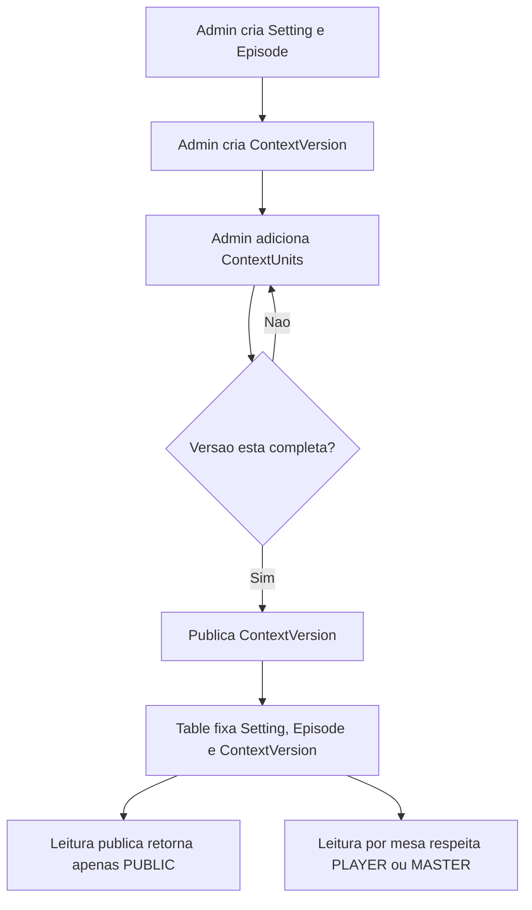
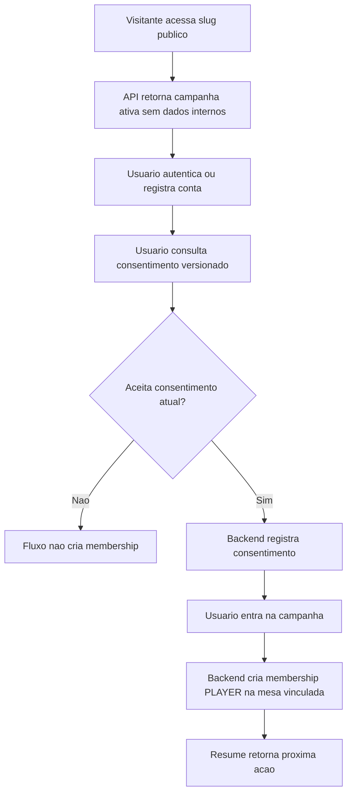
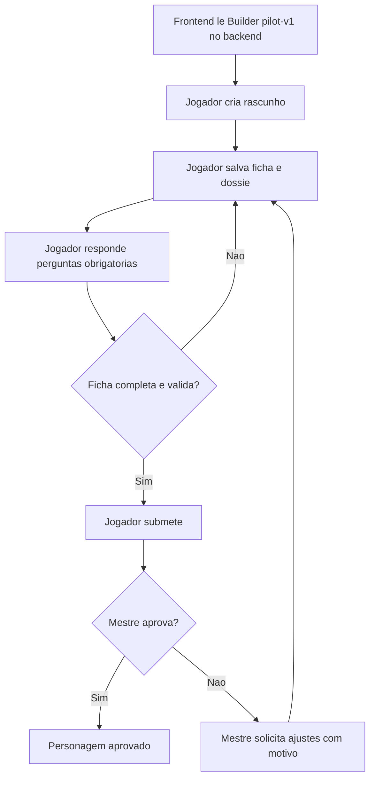
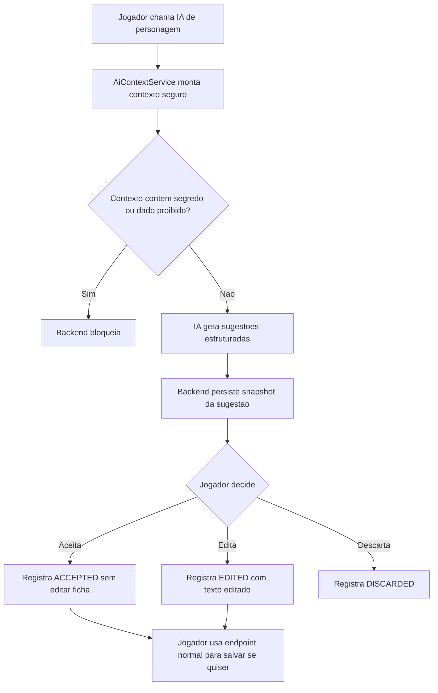
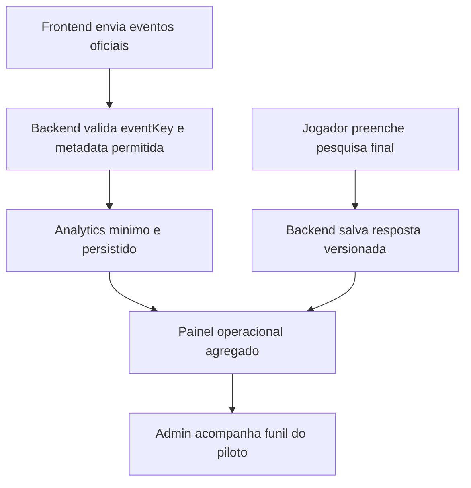

# Analise critica dos fluxos e tratamento de informacoes

Data da analise: 2026-08-11  
Escopo: documentos em `docs/` e fluxos backend ja descritos para o MVP `pilot-v1`.

## Documentos usados como base

- `bravantus-framework-mapeamento-produto (1).md`
- `bravantus-criterios-priorizacao.md`
- `bravantus-criterios-hotspots-ia.md`
- `context-package-01.md`
- `table-package-02.md`
- `character-package-03.md`
- `ai-context-package-04.md`
- `character-builder-pilot-v1.md`
- `public-campaign-pilot.md`
- `mvp-backend-backlog.md`
- `mvp-backend-endpoints.md`
- `permissions-model.md`
- `pilot-api-validation.md`
- `ai-assistant.md`

## Veredito executivo

Estamos atendendo o necessario para seguir com o projeto dentro do recorte do MVP atual: piloto publico, consentimento, entrada segura, retomada, criacao de personagem, revisao pelo Mestre, IA assistiva controlada, analytics minimo, pesquisa final e painel operacional.

O ponto critico e que isso ainda nao significa que o produto completo esta pronto. O sistema esta maduro para continuar para frontend/playtest do fluxo de criacao de personagem, desde que a validacao em banco descartavel seja executada antes de tratar o piloto como tecnicamente confiavel. Fluxos como sessao, D20 em mesa, combate, Cronica da Mesa, modo espectador e Manual do Mestre ainda estao fora do escopo implementado ou parcialmente estacionados.

## Fluxos correspondentes ao que foi criado

### 1. Fundacao de contexto e canon

Analise: este fluxo esta bem alinhado ao framework porque separa entrada, artefato, visibilidade, canon e criterio de publicacao. A decisao mais forte foi separar `classification` de `visibility`, evitando tratar "canonico" como sinonimo de "publico".

### 2. Campanha publica e entrada do participante

Analise: o fluxo atende bem a necessidade do piloto fechado. O slug publico nao revela indisponibilidade interna, o consentimento e versionado, e a entrada vincula o usuario somente a mesa configurada. Isso reduz risco operacional e risco de vazamento.

### 3. Character Builder e ciclo de revisao

Analise: o fluxo e central, recorrente e de alto risco, portanto foi corretamente priorizado. O backend versiona a configuracao do Builder, valida catalogos e perguntas, preserva revisoes humanas e impede edicao indevida quando a ficha esta submetida ou aprovada.

### 4. IA assistiva do jogador

Analise: este e o fluxo com melhor aderencia aos criterios de hotspot. A IA trabalha sobre texto/ficha/contexto, tem limite claro, nao decide, nao altera ficha, nao publica, usa `store: false`, aplica rate limit e depende de membership ativa. A separacao entre sugestao e salvamento e essencial para preservar autonomia humana.

### 5. Pesquisa, analytics e painel operacional

Analise: o desenho atende ao objetivo de aprender com o piloto sem transformar analytics em deposito de dados sensiveis. A regra de metadata proibida protege prompt integral, ficha completa, respostas narrativas, tokens e segredos.

## Como estamos lidando com as informacoes

### Pontos fortes

1. Fonte de verdade clara para o Builder: `pilot-v1` vive no backend, e o frontend deve consumir API em vez de duplicar catalogos e regras.
2. Separacao entre publico, jogador, Mestre e Admin: `AccountRole.ADMIN` nao vira `MASTER` de mesa automaticamente.
3. Contexto versionado e fixado na mesa: uma mesa nao muda silenciosamente para a ultima versao publicada.
4. Segredo filtrado no banco antes de retornar ao publico: o backend nao carrega tudo para filtrar depois em memoria nas leituras publicas.
5. IA com limites de produto: sugere, resume ou valida; nao decide, nao aprova, nao canoniza e nao altera ficha.
6. Auditoria razoavel para o MVP: consentimento versionado, eventos de revisao, snapshot de sugestao de IA, decisao do jogador e analytics tecnico minimo.
7. Documentacao de contratos ampla: o OpenAPI e os documentos de endpoint descrevem rotas, autenticacao, estados e erros principais.

### Fragilidades e riscos

1. Validacao de integracao ainda bloqueada por ambiente. O backlog marca o Supabase/PostgreSQL descartavel como pendente. Sem isso, a confianca final do piloto ainda e limitada.
2. O frontend esta fora do escopo dos documentos de backend. O fluxo existe na API, mas ainda precisa ser comprovado na experiencia real do jogador.
3. Alguns documentos historicos ficaram desatualizados. `character-package-03.md` ainda menciona que a validacao contra catalogo aprovado estava pendente, enquanto o backlog e `character-builder-pilot-v1.md` indicam que `pilot-v1` resolveu isso. Isso pode confundir proximas implementacoes.
4. `SPECTATOR` e `SPECIFIC_CHARACTER` existem como conceitos de visibilidade, mas nao estao implementados como leitura real por mesa/personagem. Isso e correto para o MVP, mas precisa continuar explicitamente fora do escopo ate haver regra.
5. Entrega real de convite por e-mail continua pendente no pacote de mesas. Para o fluxo publico por slug isso nao bloqueia, mas bloqueia convite tradicional de mesa.
6. O modelo de `Character` ainda carrega compatibilidade legada, incluindo `classId` obrigatorio. A solucao atual e pragmatica, mas deve ser tratada como divida tecnica controlada.
7. O painel operacional inclui dados administrativos sensiveis, como dossies e submisssoes. O acesso por `ADMIN` reduz risco, mas seria recomendavel explicitar politica de minimizacao, retencao e auditoria de leitura antes de um piloto externo maior.
8. Sessao, D20, combate, Cronica da Mesa e modo espectador ainda nao devem ser presumidos como resolvidos. Eles aparecem como fluxos importantes nos documentos de produto, mas nao fazem parte do contrato completo atual.

## Atendimento aos criterios dos documentos prescritos

| Criterio dos documentos | Status | Analise |
|---|---|---|
| Macrofluxos mapeados com resultado, papel, artefato e risco | Parcialmente atendido | Os fluxos backend principais estao claros, mas falta um inventario macro unico consolidando produto inteiro, manual, sessao, cronica e espectador. |
| Priorizacao por centralidade, risco e impacto | Atendido no MVP | Character Builder, campanha publica, contexto seguro e IA assistiva foram escolhas coerentes para destravar playtest. |
| Entradas e saidas com criterio de aceite | Bem atendido no backend | Endpoints, estados, erros, versoes e validacoes estao documentados. |
| Separacao de visibilidade e spoiler | Bem atendido | Contexto publico, jogador, Mestre e Admin estao separados; IA do jogador bloqueia conteudo secreto. |
| IA com governanca humana | Bem atendido | IA nao decide nem altera ficha; sugestoes exigem decisao separada do jogador. |
| Evidencia tecnica para seguir | Parcial | Typecheck/build/OpenAPI estao previstos, mas integracoes reais dependem de banco descartavel ainda pendente. |
| Prontidao para produto completo | Ainda nao | O projeto pode seguir para piloto de criacao de personagem, nao para promessa de jogo completo. |

## Hotspots atuais

### Hotspot 1: validacao em banco descartavel

Fluxo: preparacao tecnica da API para piloto  
Risco principal: tecnico e operacional  
Intervencao recomendada: provisionar Supabase/PostgreSQL descartavel e executar suites condicionadas  
Dono da aprovacao: Admin/Responsavel tecnico  
Criterio de aceite: integracoes rodam com `TEST_DATABASE_CONFIRMED_DISPOSABLE=true` e resultado e registrado sem credenciais.

### Hotspot 2: consistencia documental entre Pacote 03 e Builder pilot-v1

Fluxo: Character Builder e ciclo de revisao  
Risco principal: divergencia de regra e retrabalho  
Intervencao recomendada: atualizar `character-package-03.md` ou criar nota de supersessao apontando que `pilot-v1` passou a ser fonte de verdade  
Dono da aprovacao: Product Owner/Responsavel tecnico  
Criterio de aceite: nenhum documento ativo afirma como pendente algo ja resolvido pela configuracao oficial.

### Hotspot 3: fronteira entre fluxo de backend e experiencia real do jogador

Fluxo: campanha publica, builder e IA assistiva  
Risco principal: experiencia  
Intervencao recomendada: checklist de frontend/playtest cobrindo landing, login, consentimento, join, resume, builder, IA, submissao e pesquisa  
Dono da aprovacao: Product Owner  
Criterio de aceite: um jogador consegue completar o fluxo sem chamada manual de endpoint.

### Hotspot 4: dados administrativos sensiveis no painel operacional

Fluxo: pesquisa, analytics e painel operacional  
Risco principal: privacidade e exposicao indevida  
Intervencao recomendada: politica explicita de minimizacao, retencao e auditoria para dossies, submisssoes e respostas livres  
Dono da aprovacao: Admin/Product Owner  
Criterio de aceite: painel mostra o minimo necessario por papel e nao replica conteudo narrativo em analytics.

### Hotspot 5: proximos fluxos estruturais ainda fora do MVP

Fluxo: sessao, D20, Cronica da Mesa e espectador  
Risco principal: escopo e promessa de produto  
Intervencao recomendada: aplicar o Framework Bravantus antes de implementar cada um desses fluxos  
Dono da aprovacao: Product Owner/Autor  
Criterio de aceite: cada fluxo tem entrada, etapas, entrega, risco, permissao, visibilidade e limite de IA definidos antes de virar tarefa tecnica.

## Recomendacao para seguir

1. Seguir com o projeto no recorte do piloto de criacao de personagem.
2. Antes de abrir para teste externo, executar a validacao em banco descartavel e registrar o resultado.
3. Criar um documento unico de inventario macro do produto com 5 a 15 fluxos, usando o framework, para evitar confundir "MVP de personagem" com "Bravantus completo".
4. Atualizar documentos historicos que foram superados por decisoes recentes, especialmente onde `pilot-v1` resolveu pendencias antigas.
5. Tratar frontend/playtest como proxima etapa natural: a API esta organizada, mas a experiencia ainda precisa provar que o jogador entende e conclui o fluxo.
6. Manter sessao, D20, Cronica da Mesa e espectador fora de promessas de curto prazo ate que sejam mapeados pelo mesmo padrao usado no Builder.

## Conclusao

A arquitetura atual e coerente com os documentos prescritos: ela protege informacao sensivel, respeita papeis, versiona contexto e Builder, limita IA e registra decisoes relevantes. O projeto tem base suficiente para avancar no piloto de criacao de personagem.

A decisao critica e nao superestender o significado desse avanco. O que esta pronto e um caminho seguro para validar entrada, criacao assistida e revisao de personagem. O que ainda falta e provar esse caminho em ambiente descartavel, transformar a API em experiencia de usuario e mapear os proximos macrofluxos antes de implementa-los.
