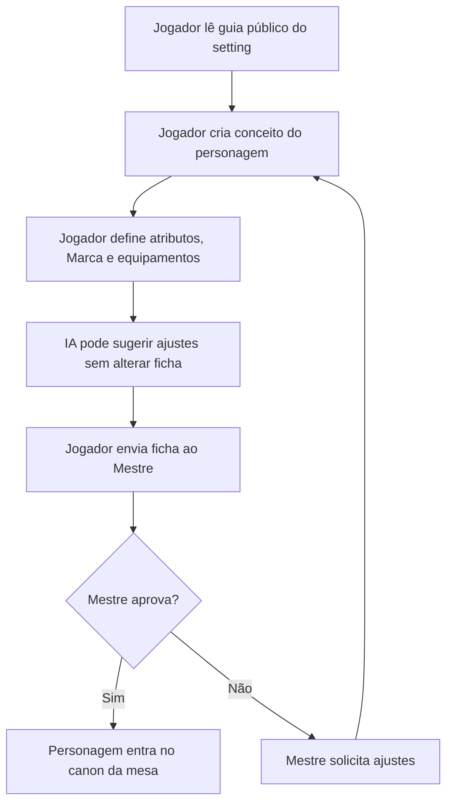

# Framework Bravantus de Mapeamento de Produto, Regras e Fluxos

**O que é:** método de 5 perguntas para mapear fluxos reais do projeto Bravantus, identificar gargalos de criação, desenvolvimento, narrativa, regras de RPG e uso de IA, e transformar decisões criativas em artefatos claros para produto, manual e implementação.

**Onde é usado:**
- **BP01** — Pergunta 1: inventário macro de frentes, fluxos e artefatos do produto.
- **BP02** — priorização dos fluxos mais importantes usando os critérios do documento `bravantus-criterios-priorizacao.md`.
- **BP03** — Perguntas 2, 3, 4 e 5 aplicadas ao fluxo escolhido para detalhamento.
- **BP04** — diagnóstico de hotspots, riscos, automações e pontos onde IA pode ajudar.

**Filosofia do framework:** mapear o Bravantus REAL — com dúvidas criativas, dependências de lore, conflitos entre regra e fantasia, pendências de manual, decisões de produto, limites de IA e fluxos técnicos incompletos. O fluxo idealizado não revela onde o produto pode quebrar. O fluxo real revela onde a experiência do jogador, do Mestre, do espectador e da IA precisa de governança.

---

## Pergunta 1 · Mapa macro do produto

**Pergunta ao time/autor:** *"Liste todas as frentes, fluxos ou macroprocessos do Bravantus. Para cada um, diga em uma frase qual resultado final ele entrega para o produto."*

### Objetivo

Obter a visão panorâmica do produto antes de mergulhar em uma tela, regra, endpoint ou capítulo específico. Isso evita o erro de desenvolver o que está mais visível no momento e não o que sustenta a experiência central de Bravantus.

### O que é um macrofluxo Bravantus

Um **macrofluxo** tem 4 características:

1. **Resultado final tangível** — algo que pode ser nomeado: "Manual do Jogador validado", "personagem aprovado", "episódio publicado", "ação transformada em crônica".
2. **Usuário ou papel afetado** — Jogador, Mestre, Espectador, Autor, Admin ou IA Assistente.
3. **Sequência reconhecível de etapas** — mesmo que ainda informal, é possível descrever começo, meio e fim.
4. **Impacto na fantasia ou operação do produto** — ajuda Bravantus a ser jogável, compreensível, seguro, publicável ou escalável.

Uma **microtarefa** é parte de um macrofluxo. Não deve ser tratada como macrofluxo isolado.

| ✅ Macrofluxo Bravantus | ❌ Microtarefa |
|---|---|
| Criação de personagem do Jogador | Escrever nome do personagem |
| Aprovação de personagem pelo Mestre | Clicar em aprovar |
| Abertura de episódio oficial | Escolher título do episódio |
| Resolução de ação com D20 | Rolar um dado isolado |
| Transformar ações em Crônica da Mesa | Reescrever um parágrafo |
| Publicação de conteúdo do setting | Adicionar uma imagem |
| Governança de IA e spoilers | Criar um prompt solto |

### Saída esperada da BP01

Tabela markdown com 7 colunas:

| Macrofluxo | Resultado final | Papel principal | Frequência | Artefato gerado | Risco principal | Status |
|---|---|---|---|---|---|---|
| Ex.: Criação de personagem | Personagem jogável enviado ao Mestre | Jogador | Por mesa/personagem | Ficha + história + Marca | Personagem quebrar canon ou regra | Rascunho |

Quantidade esperada: **entre 5 e 15 macrofluxos**.

- Menos de 5 → inventário incompleto; procurar fluxos de Mundo, Regras, Personagem, Mestre, IA, Crônica e Técnica.
- Mais de 15 → provavelmente há microtarefas misturadas; consolidar por jornada ou resultado.

### Macrofluxos iniciais recomendados para Bravantus

| Frente | Macrofluxos esperados |
|---|---|
| Mundo e setting | Definir canon público, canon secreto, locais, facções, ameaças, glossário |
| Manual do Jogador | Ensinar RPG, personagem, D20, Marca, atributos, equipamentos, combate, missões |
| Manual do Mestre | Ensinar condução, dificuldade, inimigos, spoilers, crônica, IA e consequências |
| Personagem | Criar, revisar, aprovar, evoluir e registrar personagem |
| Mesa | Criar mesa, convidar jogadores, escolher episódio, controlar visibilidade |
| Episódios | Preparar, abrir, conduzir, resolver e encerrar episódios |
| Ações e dados | Propor ação, solicitar teste, rolar D20, interpretar resultado, aprovar consequência |
| Crônica | Consolidar eventos, gerar rascunho, remover spoilers, publicar versão pública |
| IA | Filtrar contexto, sugerir sem decidir, respeitar RBAC/ABAC e canon |
| Técnica | Transformar regras em modelos, endpoints, permissões, validações e UI |

---

## Pergunta 2 · Gatilho e insumo

**Pergunta ao time/autor:** *"O que precisa acontecer para esse fluxo começar? Quem ou o quê entrega o ponto de partida, e em que formato ele chega?"*

### Objetivo

Descobrir a entrada real do fluxo. Em Bravantus, muitos problemas nascem quando um fluxo começa com insumo frágil: lore solta, regra não aprovada, história em texto livre, imagem sem contexto, prompt sem limite, jogador sem orientação ou requisito técnico sem aceitação clara.

### O que investigar

- **Quem inicia**: Autor, Mestre, Jogador, Espectador, Admin, sistema ou IA.
- **Qual é o insumo**: trecho de lore, capítulo do manual, regra, ficha, ação de jogador, evento de mesa, decisão de produto, issue técnica.
- **Formato do insumo**: Markdown, PDF, formulário, tela, banco, Discord, GitHub, prompt, imagem, áudio, planilha.
- **Estado do insumo**: rascunho, aprovado, publicado, secreto, público, dependente de validação.
- **Pré-tratamento necessário**: limpar texto, separar spoiler, definir canon, revisar regra, validar ficha, mapear permissão.

### Sinais de hotspot na entrada

- Lore chega solta e precisa virar regra, tela ou episódio.
- Regra está no texto, mas não está estruturada para desenvolvimento.
- Jogador precisa criar personagem sem saber limites do setting.
- Mestre recebe ações muito abertas e precisa reorganizar tudo.
- IA recebe contexto demais e pode revelar spoiler.
- Requisito técnico nasce sem critério de aceite.
- Um mesmo conteúdo existe em vários lugares e diverge.

### Saída esperada

Para cada fluxo escolhido, registrar:

| Entrada | Quem entrega | Formato | Estado | Pré-tratamento | Risco se entrar ruim |
|---|---|---|---|---|---|

---

## Pergunta 3 · Detalhamento do fluxo real

**Pergunta ao time/autor:** *"Descreva o fluxo escolhido passo a passo: o que acontece, em que ordem, quem participa, qual artefato muda, quais regras são aplicadas e quanto tempo ou esforço cada etapa consome."*

### Objetivo

Construir o mapa real do fluxo, com passos operacionais, criativos e técnicos. Este mapa será usado para gerar Mermaid, critérios de desenvolvimento, permissões, regras de IA e possíveis componentes do sistema.

### Como conduzir

Provocar o real:

- Se o fluxo parece linear → *"Onde ele trava? Onde volta para revisão?"*
- Se falta papel → *"Quem decide isso: Jogador, Mestre, Autor ou sistema?"*
- Se falta regra → *"Isso está no Manual do Jogador, Manual do Mestre ou ainda está na sua cabeça?"*
- Se envolve IA → *"A IA sugere, valida, resume ou decide? Quem aprova?"*
- Se envolve lore → *"Isso é público, segredo do Mestre ou canon do Autor?"*
- Se envolve sistema → *"Isso vira campo, permissão, endpoint, tela, evento ou notificação?"*

### O que investigar em cada etapa

| Campo | Descrição |
|---|---|
| Ação concreta | Verbo + objeto: "criar personagem", "validar Marca", "rolar D20" |
| Papel responsável | Jogador, Mestre, Autor, Admin, IA, sistema |
| Artefato alterado | Ficha, episódio, crônica, manual, regra, banco, timeline |
| Regra aplicada | Regra de RPG, canon, spoiler, permissão, UI, IA |
| Visibilidade | Público, Jogadores, Mestre, Autor, Espectador |
| Canon | Oficial, Setting, Mesa, Rascunho, Crônica pública |
| IA permitida? | Não; sugerir; resumir; revisar; validar; nunca decidir |
| Tempo/esforço | Estimado em minutos, horas ou complexidade |
| Dependências | Alguém precisa aprovar? Existe dado externo? |

### Saída esperada

Um mapa Mermaid com **6 a 14 atividades** e retornos quando houver revisão.

Exemplo:



### Sinais de hotspot no detalhamento

- Etapa que depende de decisão criativa não documentada.
- Etapa com risco de spoiler ou quebra de canon.
- Etapa em que IA poderia ajudar, mas precisa de limite forte.
- Etapa que gera retrabalho entre jogador e Mestre.
- Etapa que precisa virar regra técnica, mas ainda está em linguagem solta.
- Etapa repetitiva que o Mestre terá que fazer em toda sessão.
- Etapa em que o jogador pode se perder por falta de guia.

---

## Pergunta 4 · Entrega e passagem de bastão

**Pergunta ao time/autor:** *"Quando esse fluxo termina, o que exatamente é entregue, para quem vai, em qual formato, e qual critério prova que está pronto para a próxima etapa?"*

### Objetivo

Mapear a saída do fluxo e evitar entregas ambíguas. Em Bravantus, uma entrega pode ser um capítulo do manual, uma regra aprovada, uma ficha validada, uma crônica publicada, uma issue técnica pronta ou um episódio disponível para mesa.

### O que investigar

- **Resultado entregue**: ficha, regra, documento, tela, endpoint, crônica, episódio, prompt, checklist.
- **Quem consome**: Jogador, Mestre, Autor, Espectador, equipe técnica, IA.
- **Formato final**: Markdown, PDF, UI, banco, API, prompt versionado, card de backlog.
- **Critério de aceite**: como saber que está correto?
- **Próxima etapa**: o que fica desbloqueado após essa entrega?
- **Comunicação**: onde é avisado? Discord, GitHub, Notion, documento, sistema.

### Sinais de hotspot na saída

- Resultado precisa ser reformatado em vários lugares.
- Próxima pessoa sempre pede contexto adicional.
- Entrega é feita, mas não se sabe se foi aprovada.
- Manual, regra e sistema ficam inconsistentes.
- IA usa conteúdo antigo porque não há fonte de verdade.
- Crônica pública pode revelar segredo sem revisão.

### Saída esperada

| Entrega | Consumidor | Formato | Critério de aceite | Próxima etapa | Risco |
|---|---|---|---|---|---|

---

## Pergunta 5 · Dor, risco e decisão

**Pergunta ao time/autor:** *"Onde esse fluxo pode quebrar a experiência, o canon, a regra, a segurança, a IA ou a operação? O que hoje só funciona porque está na cabeça do autor ou do Mestre?"*

### Objetivo

Encontrar as dores reais do produto. Em Bravantus, o risco não é apenas perder tempo: é criar uma experiência confusa, genérica, sem alma, com IA invadindo espaço humano, regras contraditórias ou spoilers revelados.

### O que investigar

- **Risco de fantasia** — o fluxo deixa Bravantus mais vivo ou mais genérico?
- **Risco de regra** — existe regra clara para resolver a ação?
- **Risco de canon** — pode contradizer lore oficial?
- **Risco de spoiler** — jogador ou espectador pode ver segredo?
- **Risco de IA** — IA está sugerindo ou decidindo?
- **Risco técnico** — existe permissão, validação e registro de auditoria?
- **Risco de experiência** — o jogador entende o que fazer?
- **Conhecimento tácito** — o que só o autor/Mestre sabe e precisa virar regra/documento?

### Como conduzir com sensibilidade

A pergunta pode expor fragilidades do projeto: regras incompletas, lore indefinida, falta de fluxo técnico, IA sem limite, excesso de ambição ou confusão entre produto e ferramenta. O objetivo não é criticar, mas transformar intuição criativa em estrutura reutilizável.

### Sinais fortes de hotspot

- "Isso ainda está na minha cabeça."
- "O Mestre decide no feeling."
- "A IA poderia ajudar, mas tenho medo dela inventar."
- "O jogador pode não entender como criar personagem."
- "Não sei onde termina Manual do Jogador e começa Manual do Mestre."
- "Isso pode revelar spoiler."
- "Isso impacta várias telas e regras."

---

## Após as 5 perguntas — Diagnóstico Bravantus

Com as respostas das 5 perguntas, gerar 4 artefatos:

1. **Mapa Mermaid do fluxo real** — com papéis, retornos e decisões.
2. **Matriz Impacto × Esforço × Risco** — prioriza o que deve ser resolvido primeiro.
3. **Cards dos 3-5 hotspots** — cada card traz nome, critérios atendidos, risco, proposta de intervenção e dono humano.
4. **Contrato de IA e Permissões** — define contexto permitido, ações da IA, aprovação humana e nível de visibilidade.

### Template de card de hotspot

```markdown
## Hotspot: [nome]

**Fluxo:** [nome do macrofluxo]
**Etapa do mapa:** [nome exato da atividade]
**Papel afetado:** [Jogador/Mestre/Autor/Espectador/IA/Sistema]
**Critérios atendidos:** [lista]
**Risco principal:** [experiência, canon, spoiler, regra, técnico, IA]
**Intervenção proposta:** [skill, prompt, validação, tela, checklist, regra, documento]
**Dono da aprovação:** [Autor/Mestre/Admin]
**Critério de aceite:** [como validar]
```

---

## Regra de ouro do Framework Bravantus

**Todo fluxo importante precisa responder três perguntas antes de virar desenvolvimento:**

1. **Por que isso existe no mundo e na experiência?**
2. **Como isso é usado pelo Jogador, Mestre, Espectador, Autor ou IA?**
3. **Quais limites impedem que isso quebre regra, canon, spoiler ou autonomia humana?**

Se uma ideia não responde essas três perguntas, ela ainda não está pronta para virar sistema.
